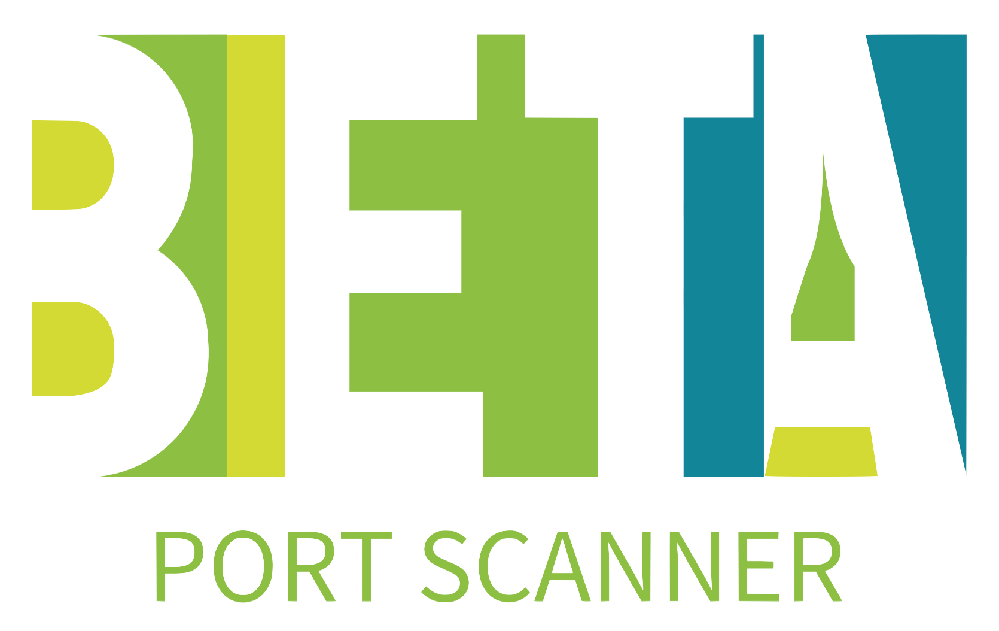

<p align="center">
  
</p>

<p align="center">
    
    
    
</p>

## 📜 Description

**Beta** is a **Port Scanner** application developed as a learning tool in the fields of cybersecurity and Python programming. Beta aims to provide practical insights into scanning and analyzing open ports on target machines. This application is designed for use in a testing and learning environment with a focus on network security and software development.

### Key Features:

- **Port Scanning**: Efficiently scans for open ports on specified IP addresses or network ranges. Provides detailed information about discovered services and their associated ports.
- **Multi-threading**: Utilizes multi-threading to perform concurrent scans, significantly reducing the time required to scan large networks.
- **Customizable Scans**: Allows users to specify target ports, IP addresses, and scanning options, making it adaptable to different scenarios.
- **Result Reporting**: Generates structured and formatted scan reports, making it easy to interpret and analyze the results.
- **Interactive CLI**: Features a command-line interface built using `rich.console` to display real-time progress and results in a user-friendly manner.

### Learning Objectives:

- **Understanding Port Scanning**: Learn about the importance of port scanning in network security and how it can be used to identify vulnerabilities.
- **Python Programming**: Enhance skills in Python programming, particularly in networking and concurrent programming. Learn how to utilize libraries such as `socket`, `threading`, and `rich.console` to build effective and responsive applications.
- **Application Development**: Understand techniques and best practices for developing CLI applications, with a focus on usability and performance.

**Note**: Beta is designed for educational and testing purposes. Use of this application should be conducted in a safe and legal environment and adhere to applicable cybersecurity laws and ethics.

### Examples

#### Single IP

```bash
python3 beta.py 192.168.1.1
```

#### IPs from a file

```bash
python3 beta.py -l ip_list.txt
```

#### Multiple IPs and Domains

```bash
python3 beta.py 192.168.1.1 example.com 192.168.1.2
```

#### CIDR Range

```bash
python3 beta.py 192.168.1.0/24
```

#### IP Range

```bash
python3 beta.py 192.168.1.0-192.168.2.254
```


## 📚 Reference Tools

- **Nmap** by [nmap.org](https://nmap.org) - A well-known network scanning tool used for discovering hosts and services on a computer network.
